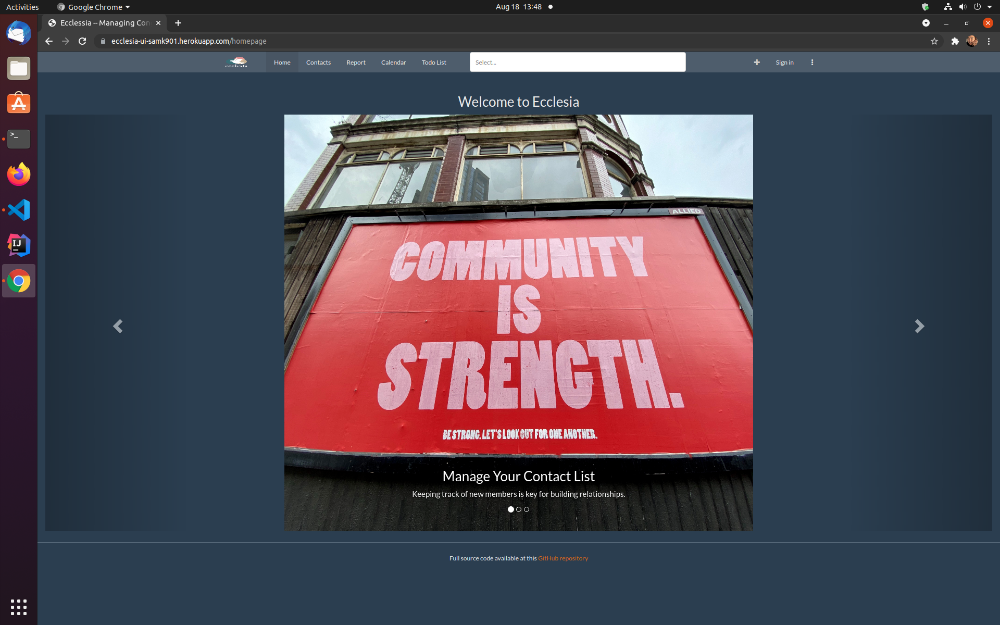
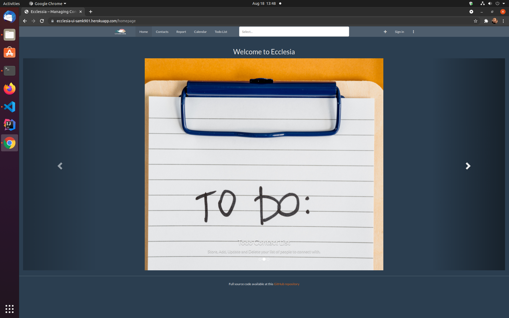
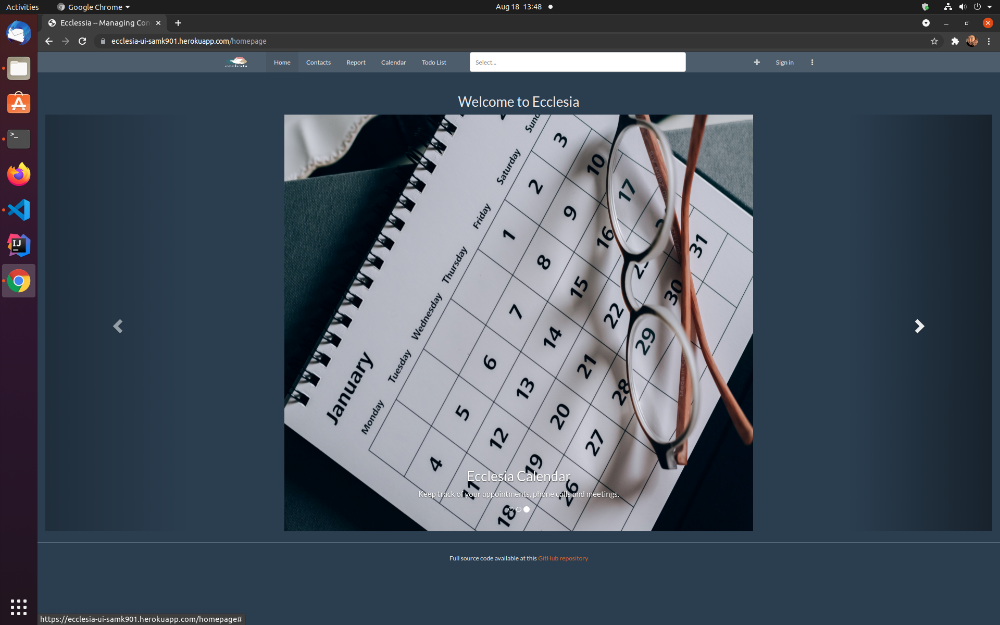
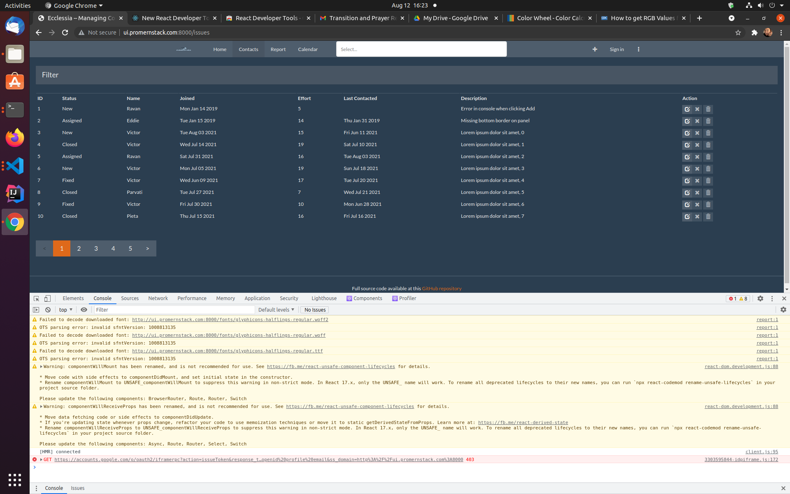
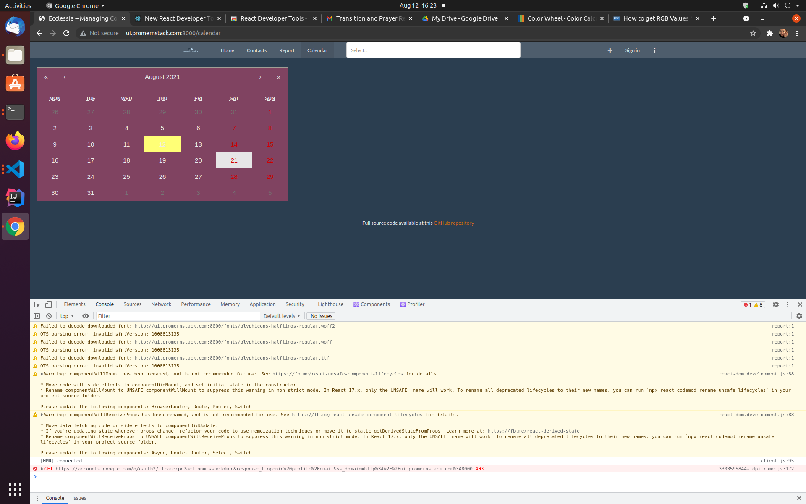

# EcclesiaWebApp
CRM Application modified for Churches and Non-Profits using the MERN Stack

Source Code Links:
** Please note that I could not migrate these to the ccs github without losing the commit history **
API: https://github.com/samk901/Ecclesia-api
UI: https://github.com/samk901/Ecclesia-ui

Application UI: https://ecclesia-ui-samk901.herokuapp.com/  

# Iter 3

In this iteration, we developed a CRUD schema using Mongoose and Axios to handle http requests. I could not get this functionality to integrate with the book project, so I am just relying on the book's implementation for my core functionality. Ideally, I would have a todo contact list that would keep track of people to contact. Ultimately, I needed more time with the book to understand how to put all the pieces together. I probably would have had a better time using GraphQL like the book or startin a new React application with Mongoose and Axios. For now the application has a simple placeholder for the Todo list component page. 

We added more functionality to our landing page (homepage), where we used bootstrap's carousel to show the user the core functioanlity of the web application. We also improved styling on the webpage using some bootstrap templates. 

We were able to satisfy most of our user stories from the pre-development stages of the project. Users are able to login, perform CRUD operations on contact lists, be taken to a landing page describing the application and see a calendar. Our calendar is not fully functional and our todo list for managing communication needs to be connect properly to the backend. Hopefully this will be implemented later down the line. 

## Iter 2

In this iteration, we added some styles in addition to the standard Bootstrap CSS using a template available online. We also added a Homepage that will serve as our landing page and adapted the routing from the book project. We also began implementing a Calendar Component using React-Calendar, which will allow a user to keep track of meetings. The next step is to continue implementing the calendar, implement a Reading List page and finish the homepage. 

## Iter 1

In this iteration the basic structure of our web application has been completed. I will be using the IssueTracker from Pro MERN to serve as working template. The primary CRUD operations have been adapted for the project to serve as a way for the user to maintain contact lists for this Customer Relationship Management (CRM) web application. 

Currently we have a placeholder for the Calendar page, but the plan is to implement a working Google Calendar, using their Calendar API. This iteration meets the users desire to have a working, deployed UI with basic CRUD operations. 

Also, the fields of the database and consequently its schema will need to be adapted for Contact information. 
